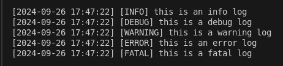

# Simple Logger  
**As simple as possible**  


## Description
Simple logger is a **singleton**, **thread safe**, **header only** C++(17+) logger with focus on **simplicity**. It's simple to use and to integrate.  
You should take no more then 10 minutes ([5 Step Guide](#5-step-guide)) to learn how to use it and integrate it in your own project. And if I'm wrong maybe you are too novice or just dumb! Anyway I like you, so let me know!  
Simple logger use the **RAII** idiom, that means that you don't have to take care about memory managment, but just to use it!
## Contribute
Suggestion and contribution are welcome! Just contact me and I'll be glad to answer you
## Requiriments
- C++ 17+  

It's possible that in future it's going to support older version. At least 14 and maybe 11. Let's see
## Supported Platforms and Compilers
### Platforms
At this stage I'm not going to provide any officially supported platforms, but for some easy test I excpet it to work on all major linux distros and windows 10+.  
### Compilers
**gnu** , **clang** and unofficially **mvsc**
## 5 Step Guide
1. #### Import the _logger.hpp_ file. 
2. #### Include the header where you are going to use it!  
    - `#include <logger.hpp>` (good practice) in this case be sure that is in your _include_. If you don't now what I mean for _include_ path check this /* LINK */
    - `#include "path-to-file/logger.hpp"`  
3. #### Declare a **global variable**, maybe in your main.cpp (good practice)  
    ```c
    sl::Logger& SLOG = sl::Logger::getInstance()
    ```
    or
    ```c
    sl::Logger& logger = sl::Logger::getInstance()
    ```  
    **logger** is the default value of **SLOG**! Of course you can use other names for you variable but in this case I suggest you to read the [Complete Guide](#complete-guide)  
    If you want to log on a **file**? just pass it as argument the first time you get the instance. After it's not possible.
    ```c
    sl::Logger& SLOG = sl::Logger::getInstance("file_name");
    ```
4. #### Write a log
    ```c
    SLOG.info() << "just use the stream insertion operator as you always do";
    ```
5. #### Compile it!
    By default all log levels are **disabled** so you need to manually activate them.  
    The **simplest** way is to activate them all:  
    **gnu**
    ```bash
    g++ -D LOGLVLA -o exe main.cpp -I <path-to-file>
    ```
    **clang**
    ```bash
    clang++ -D LOGLVLA -o exe main.cpp -I <path-to-file>
    ```
## Complete Guide  

## Roadmap
Not ordered  
- [ ] Implement optional colors for the different logs levels (terminal ouotput)
- [ ] Implement _trace_ log level  
- [ ] Implement test suites
- [ ] Test it with _msvc_ and write examples (it should already work fine)
- [ ] Write the _Complete Guide_
- [ ] Implement CI
- [ ] Test it on different OS (it should already work on major linux distros and windows 10+)   
