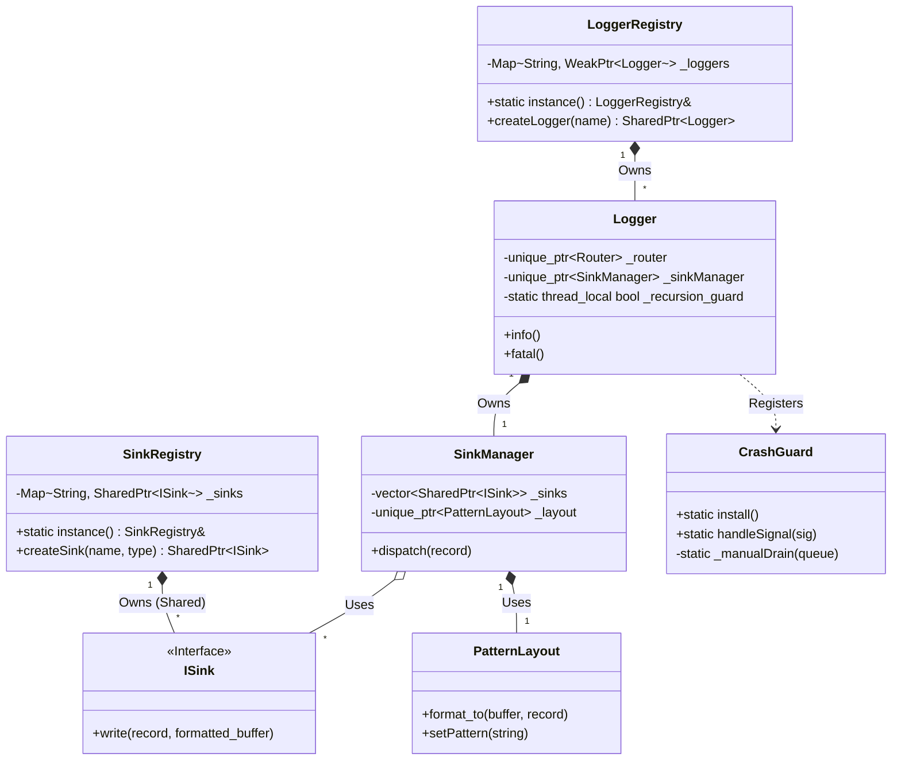

# Architecture Specification

> **Version**: 5.0 (Final Draft)
> **Date**: 2026-01-26

## 1. High-Level Architecture

The library follows a **Layered Architecture** with strict ownership managed by Registries.



## 2. Data Flow & Modes

The library operates in one of two global modes: **SYNC** or **ASYNC**.

```mermaid
graph TD
    classDef sync fill:#e1f5fe,stroke:#01579b
    classDef async fill:#e8f5e9,stroke:#2e7d32
    classDef crash fill:#ffebee,stroke:#b71c1c

    subgraph Client
        Macro[SLOG_INFO]
    end

    subgraph Core
        Registry[LoggerRegistry]
        LoggerInstance[Logger]
        Q[MPSC Queue]
        Worker[Background Thread]:::async
        SinkMgr[SinkManager]
        Layout[PatternLayout]
    end

    subgraph Outputs
        File[File Sink]
        Console[Console Sink]
        Stderr[STDERR (Emergency)]:::crash
    end

    %% Setup
    Macro -->|Get| Registry
    Registry -->|Ret| LoggerInstance
    LoggerInstance -->|Make Record| LoggerInstance

    %% Path 1: SYNC MODE
    LoggerInstance -->|Sync Path| SinkMgr:::sync
    
    %% Path 2: ASYNC MODE
    LoggerInstance -->|Async Path| Q:::async
    Q -->|Pop| Worker
    Worker -->|Dispatch| SinkMgr

    %% Shared Sink Logic
    SinkMgr -->|Format| Layout
    Layout -->|Bytes| SinkMgr
    SinkMgr -->|Write| File
    SinkMgr -->|Write| Console

    %% Crash Handling
    CrashSignal((SEGFAULT)):::crash -.->|Trigger| CrashGuard
    CrashGuard -.->|Sync Mode: Flush| SinkMgr
    CrashGuard -.->|Async Mode: Manual Drain| Q
    CrashGuard -.->|Emergency Write| Stderr
```

## 3. Core Components

### 3.1. Registry System
- **LoggerRegistry**: Singleton. Creates and tracks all Loggers. Ensures unique names and configuration inheritance.
- **SinkRegistry**: Singleton. Manages sinks that can be shared across multiple loggers (e.g., a central "App.log" file).

### 3.2. Logging Pipeline
1.  **Capture**: The `SLOG_INFO` macro captures the arguments.
2.  **Format**: Arguments are formatted immediately into a stack-allocated buffer (`std::array<char, 256>`).
3.  **Router**: checks the `LogLevel`.
4.  **Transport**:
    - **Sync**: Calls `SinkManager::dispatch` directly.
    - **Async**: Pushes the formatted string (copy) into the MPSC Ring Buffer.
5.  **Output**: Sinks write the data.

### 3.3. CrashGuard (Reliability)
A dedicated signal handling component.
- **Trigger**: `SIGSEGV`, `SIGABRT`.
- **Action**: It interrupts the program and attempts to "Drain" the MPSC Queue.
- **Mechanism**: It iterates the Ring Buffer indices manually. It does **not** take locks. It writes purely to `STDERR` or a raw file descriptor to ensure the "Death Rattle" log is saved.
- **MMap Persistence**: (Future Feature) The Ring Buffer can be backed by a Memory Mapped File. In case of power loss, the queue state is preserved on disk.

## 4. Distribution Model (STB-Style)

To support **C++11** Consumers with a **C++20** Implementation:

**`slog.hpp`** (The Interface)
- Contains only C++11 compatible headers (`<string>`, `<vector>`, `<atomic>`).
- Declares classes and structs.
- Uses Macros for the public API.

**Implementation**
- The high-performance C++20 code (`std::format`, Concepts) is hidden behind a preprocessor guard:
```cpp
#ifdef SLOG_IMPLEMENTATION
    // ... C++20 Code ...
#endif
```
- The user enables this in **exactly one** `.cpp` file in their project.

## 5. Concurrency Control

- **Instruction Ordering**: Extensive use of `std::memory_order_release` (Producer) and `std::memory_order_acquire` (Consumer) in the Lock-Free Queue.
- **Recursion Guard**: `thread_local` counters to detect re-entrant calls within the same thread (prevents Stack Overflow during error logging).
