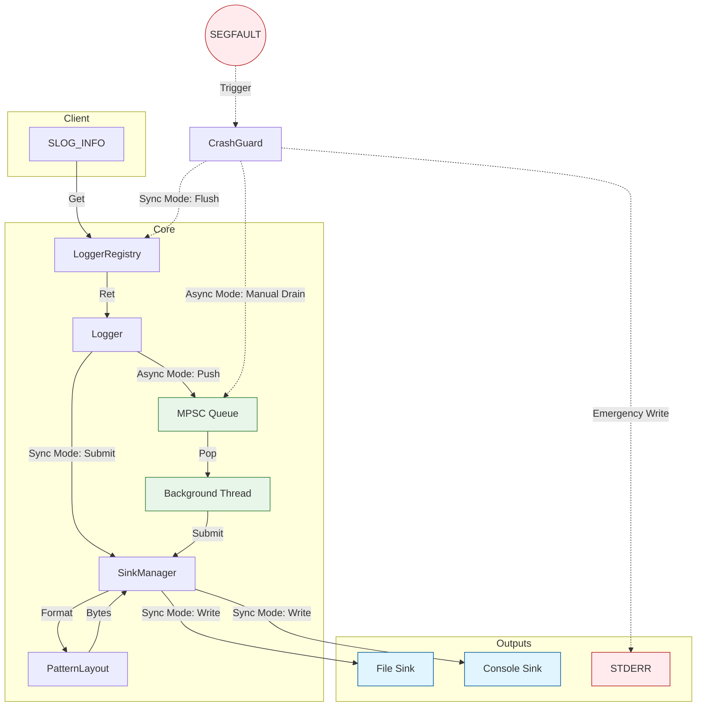

# Architecture Specification

## Data Flow

The library operates in one of two global modes: **SYNC** or **ASYNC**.

```mermaid
graph TD
    classDef sync fill:#e1f5fe,stroke:#01579b
    classDef async fill:#e8f5e9,stroke:#2e7d32
    classDef crash fill:#ffebee,stroke:#b71c1c

    subgraph Client
        Macro[SLOG_INFO]
    end

    subgraph Core
        Registry[LoggerRegistry]
        LoggerInstance[Logger]
        Q[MPSC Queue]
        Worker[Background Thread]:::async
        SinkMgr[SinkManager]
        Layout[PatternLayout]
    end

    subgraph Outputs
        File[File Sink]
        Console[Console Sink]
        Stderr[STDERR ]:::crash
    end

    %% Setup
    Macro -->|Get| Registry
    Registry -->|Ret| LoggerInstance

    %% Path 1: SYNC MODE
    LoggerInstance -->|Sync Mode: Submit| SinkMgr
    SinkMgr -->|Sync Mode: Write| File:::sync
    SinkMgr -->|Sync Mode: Write| Console:::sync
    
    %% Path 2: ASYNC MODE
    LoggerInstance -->|Async Mode: Push| Q:::async
    Q -->|Pop| Worker
    Worker -->|Submit| SinkMgr

    %% Shared Sink Logic
    SinkMgr -->|Format| Layout
    Layout -->|Bytes| SinkMgr


    %% Crash Handling
    CrashSignal((SEGFAULT)):::crash -.->|Trigger| CrashGuard
    CrashGuard -.->|Sync Mode: Flush| Registry
    CrashGuard -.->|Async Mode: Manual Drain| Q
    CrashGuard -.->|Emergency Write| Stderr
```